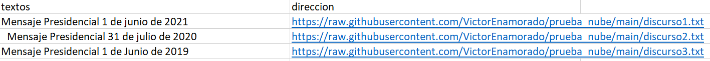
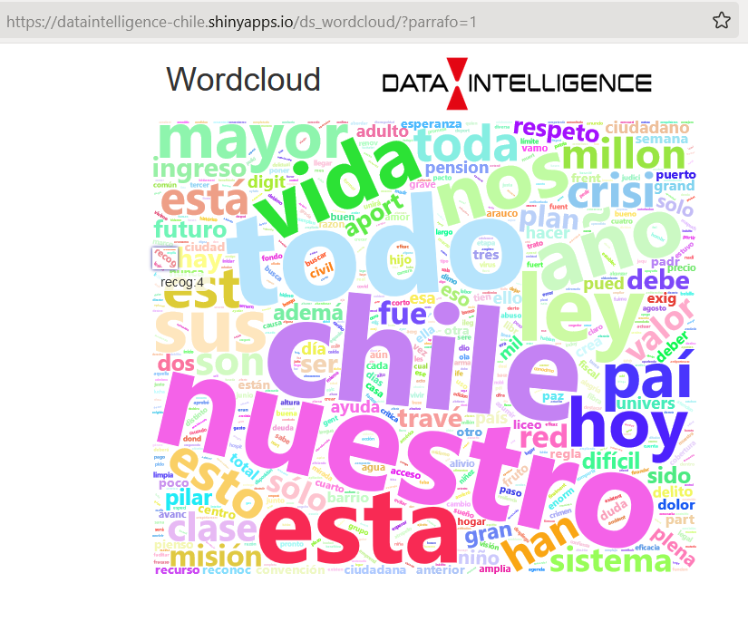
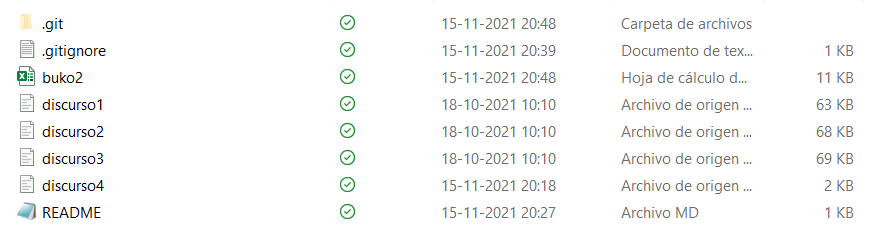

# wordcloud

Información de ShinyApp\
https://www.shinyapps.io/

***
En el repositorio:\
https://github.com/Sud-Austral/ds_insumos_wordcloud

Existe una carpeta llamada buko2 que hace las veces de diccionario: se le asocia un título a una dirección web del repositorio:\

En el que se integran los txt de cualquier texto.

***

