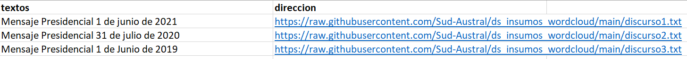

# wordcloud

Información de ShinyApp\
https://www.shinyapps.io/

***
En el repositorio: C:\Users\chris\OneDrive\Documentos\GitHub\ds_insumos_wordcloud\
Existe una carpeta llamada buko2 que hace las veces de diccionario: se le asocia 
***

